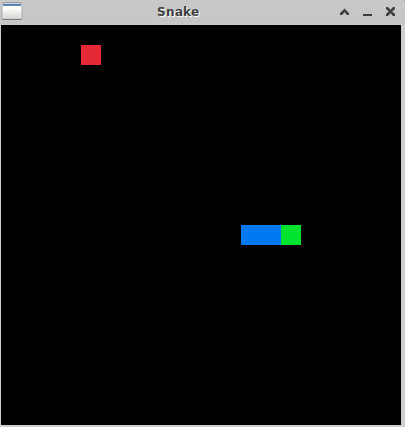

# snake
Simple snake game made with [raylib](https://www.raylib.com/)

## Basic build instuctions 

1.git clone `git@github.com:silkroad1922/snake.git`

2.Make a build directory in the top level directory: `mkdir build && cd build`

3.Compile: `cmake ..`

## Fast start in Linux

1. cd `src`

2.touch `build.sh` 

3.`chmod 700 build.sh`

4.Edit build.sh `set -e
g++ -o main  snake.cpp board.cpp main.cpp -lraylib -lGL -lm -lpthread -ldl -lrt -lX11
./main`

5.Run `./build.sh`
